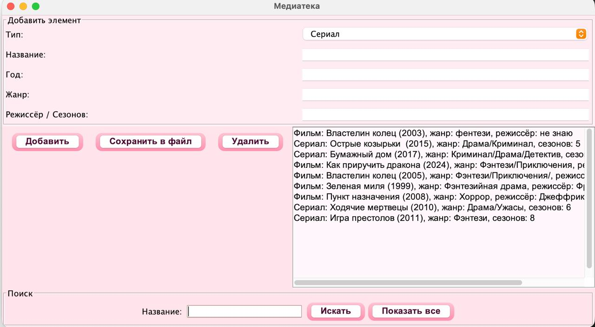

# oppProject
MediaLibrary — Desktop App for Managing Movies & Series (OOP Project)
Project Overview

MediaLibrary — это десктоп-приложение на Java + Swing, которое позволяет:

добавлять фильмы и сериалы

удалять элементы

искать по названию

просматривать весь каталог

сохранять данные в файл и загружать при запуске

Проект разработан для демонстрации ООП-принципов, событийно-ориентированного программирования и простого GUI на Swing.

Project Architecture
MediaLibrary/
├── src/
│   ├── MediaItem.java         # Абстрактный класс
│   ├── Movie.java             # Класс фильма
│   ├── Series.java            # Класс сериала
│   ├── MediaLibrary.java      # Логика хранения данных
│   ├── MediaLibraryGUI.java   # Графический интерфейс
│   └── Main.java              # Консольный вход
├── catalog.dat                # Сохранённая база
├── catalog.txt                # Текстовая версия каталога
├── photos/                    # Скриншоты проекта
│   ├── gui.png
│   ├── code_example.png
│   └── ...
└── README.md

📁 src/ — весь код
📁 photos/ — сюда добавляй скриншоты GUI и кода
📄 catalog.dat — сериализованная база
📄 MediaLibraryGUI.java — приложение с интерфейсом

Technologies Used
Programming Language

Java 17+

GUI

Java Swing

JFrame

JPanel

JButton

JTextArea

JComboBox

ActionListener

Data Storage

Java Serialization

Сохранение в файл catalog.dat

Автоматическая загрузка при запуске

OOP Concepts

✔ Инкапсуляция
✔ Наследование
✔ Полиморфизм
✔ Абстракция

OOP Examples Used in the Project
1. Абстракция (класс MediaItem)

Файл: MediaItem.java

public abstract class MediaItem implements Serializable {
    private String title;
    private int year;
    private String genre;

    public abstract String getInfo();
}

✔ Нельзя создать объект MediaItem
✔ Movie и Series обязаны реализовать getInfo()

2. Наследование: Movie и Series → MediaItem

Файл: Movie.java

public class Movie extends MediaItem {
    private String director;
}

Файл: Series.java

public class Series extends MediaItem {
    private int seasons;
}

3. Полиморфизм

Список List<MediaItem> хранит и фильмы, и сериалы:

for (MediaItem item : library.getItems()) {
    outputArea.append(item.getInfo() + "\n");
}

4. Инкапсуляция

Поля скрыты (private), доступ только через методы:

private String title;
public String getTitle() { return title; }

GUI Screenshots

Главное окно

Панель добавления фильма

Панель поиска

Application Interface (Swing)

Основное окно GUI создаётся в:

MediaLibraryGUI.java → конструктор

public MediaLibraryGUI() {
    super("Медиатека");
    library.loadFromFile("catalog.dat");
    setLayout(new BorderLayout());
    ...
}

GUI включает:

панель ввода данных

панель кнопок

поиск

область вывода результатов

Event Handling Example (ActionListener)

Файл: MediaLibraryGUI.java

Пример обработчика кнопки "Добавить"
addButton.addActionListener(this::handleAdd);

Метод:

private void handleAdd(ActionEvent e) {
    library.addItem(new Movie(title, year, genre, director));
}

Features Implemented

✔ Добавление фильмов и сериалов
✔ Удаление по названию
✔ Поиск по подстроке
✔ Просмотр всего списка
✔ Автосохранение при выходе
✔ Загрузка при старте
✔ GUI с кастомными розовыми кнопками
✔ Хранение данных между сессиями
How to Run
Запуск GUI:
javac src/*.java
java MediaLibraryGUI

или через IDEA:

Run → MediaLibraryGUI

Запуск консольной версии:
java Main
Author

Адина Каиркенова

GitHub: https://github.com/adinakairkenova

E-mail: adinohka.29@gmail.ru

License

MIT License
